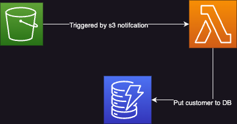

# Basic Ingest Process

This service utilizes AWS Lambda and DynamoDB to process files uploaded to an S3 bucket and convert them into customer records. When a new file is uploaded or modified in the S3 bucket, the Lambda function is triggered by S3 notifications. The function retrieves the file, transforms its contents into a customer record format, and inserts it into DynamoDB. The service provides automated file processing, efficient data conversion, and seamless integration between S3 and DynamoDB.



## Getting Started

Install the dependencies:

```bash
./auto-install.sh
```

## Terraform Project

The terraform project is structured in modules, we have a module for the S3 bucket, a module for the DynamoDB table, and a module for the Lambda function. The main.tf file is used to call the modules and set the variables. Each module has his own documentation.

## Terraform Deployment

In environments folder we have differentes folders each for a different environment, in this case we have a folder for local, pre and pro. Each folder has a main.tf file that calls the modules and sets the variables for that environment.

## Local Development

To run the service locally, you need wake up localstack docker container and run:

```bash
    localstack start
```

And then change workdir to environment/local and run:

```bash
    terraform init -backend=false -upgrade
    terraform apply -auto-approve
```

## Testing

We have mock folder where is the mock data for the test. Actually test is manually and follow next steps:

1. Listen lambda function logs:

```bash
    aws --endpoint-url=http://localhost:4566 logs tail '/aws/lambda/customer-ingest-local' --follow
```

2. Copy mock data to S3 bucket:

```bash
    awslocal s3 cp mocks/client_data.json s3://s3-ingest-zurich-local
```

3. Check logs and DynamoDB table to see the result.

```bash
    aws --endpoint=http://localhost:4566 dynamodb scan --table-name customer-local
```

## TO DO

- [ ] Add unit test
- [ ] Add integration test
- [ ] Add CI/CD
- [ ] Add monitoring
# terraform-challenge
